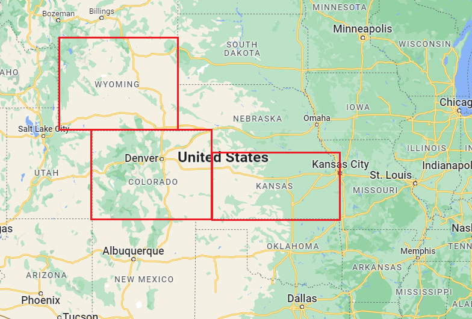
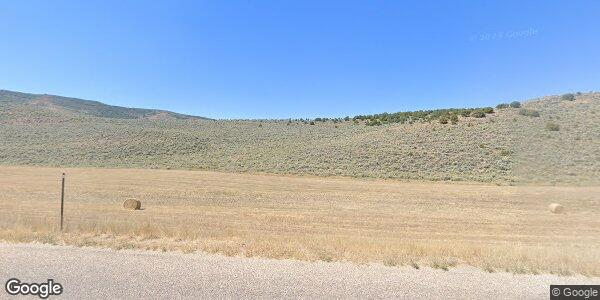
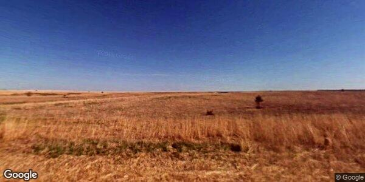
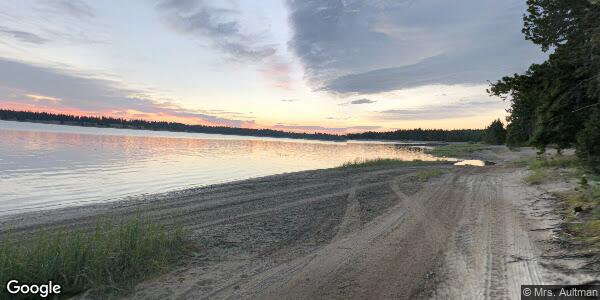

# GeoGuessr AI Model Project
This is a project that explores the feasibility of creating an AI model that can compete against human players in a simplified version of the game GeoGuessr. GeoGuessr is a free online game where players are given an image of a random location in the world from Google Street View and have to guess where they are. The game can be found here: https://www.geoguessr.com/

In this project, I simulated a simplified version of the game where players only need to guess the country they are in, and I used images from three US states (Colorado, Kansas, and Wyoming) because of their simple border shapes. The project includes a small database of labeled images obtained through the Google Street View API.

# Project Details

## Data Collection
One of the main challenges of this task is creating a database of labeled images. In this project, I used the Google Street View API to collect random images from the three selected US states.

  

## Data Set
Due to time and resource limitations, I only used a small dataset of 500 images for each country. The images were labeled and split into training and testing sets for use in creating the AI model.

## Model Creation
I used the Keras library to create a Convolutional Neural Network (CNN) model that can classify the images. The model was trained on the labeled dataset and tested on the testing set. The model was able to classify the images with an accuracy of 73% on the testing set.

## Conclusion
The results of this project show that it is possible to create an AI model that can compete against human players in a simplified version of GeoGuessr. The difficulty of the task makes it challenging even for skilled human players. However, further improvements could be made to the model with a larger and more diverse dataset.
